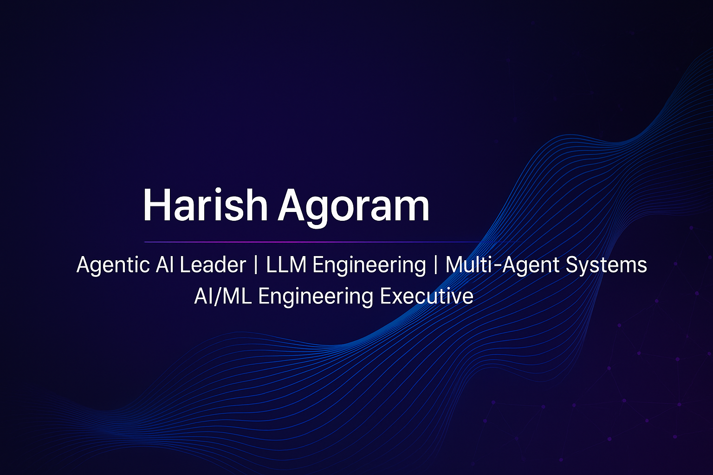

  

# Hi, I'm **Harish Agoram** 👋

I build enterprise-grade **Agentic AI systems** and help organizations transform how they operate using autonomous and semi-autonomous AI architectures. My work blends strategy, architecture, and hands-on engineering—ensuring AI systems don’t just look good in demos, but ship reliably in real-world environments where scale, security, compliance, and uptime matter.

Across a 22+ year career, I’ve led global engineering teams (Singapore, UK, India) delivering large-scale AI platforms, ML systems, and next-gen automation frameworks for Fortune 500 organizations. I specialize in multi-agent reasoning, LLM orchestration, RAG pipelines, vector databases, and full-stack AI applications deeply integrated with enterprise workflows.

I’ve shipped **67+ AI/ML systems** across CV, NLP, predictive analytics, and agentic automation—delivering **$15M+** in measurable business impact.  
My philosophy:  
**Clarity over complexity. Architecture over hacks. Production over prototypes.**

---

## 🔧 What I Work On

- Agentic AI systems: single-agent, multi-agent, autonomous workflows, domain copilots  
- Multi-agent orchestration → planning, reasoning, negotiation, verification  
- RAG pipelines → simple RAG → hybrid RAG → enterprise Graph RAG  
- LLM automation → browser agents, document intelligence, analytics copilots  
- Full-stack AI engineering → React, Next.js, FastAPI, Node.js  
- Vector search → Pinecone, Weaviate, Milvus, Qdrant, ChromaDB  
- LLM ecosystems → GPT, Claude, Mistral, Llama, Gemini  
- Production ML → AWS, Kubernetes, Docker, CI/CD, governance

---

## 💡 What I Spend Most Days Doing

- Turning ambiguous AI ideas into actionable system architectures  
- Designing multi-agent workflows that remain predictable and debuggable  
- Leading engineering teams through fast-moving AI environments  
- Ensuring deployed AI systems are observable, measurable, and safe  
- Evaluating frameworks (LangChain, CrewAI, AutoGen, MCP, SK, LlamaIndex)  
- Coaching teams on RAG, agent design, evaluation, and deployment  
- Integrating agentic systems with enterprise infrastructure  
- Reducing complexity while scaling AI across business units  

---

## 🚀 Projects & Work I’m Proud Of

While much of my enterprise work is confidential, the concepts show up in my repos:

- Blueprint architectures for agentic AI  
- Multi-agent reasoning + collaboration templates  
- Real-world RAG implementations  
- Vector search + semantic retrieval setups  
- End-to-end examples: LLM → Tools → Memory → UI  
- Evaluation workflows for grounding, accuracy, safety  
- Infrastructure patterns for scalable inference  

I value clarity, robustness, and operational reliability over flashy demos.

---

## 🔍 What I'm Exploring These Days

- Deterministic multi-agent reasoning patterns  
- Scaling agentic AI in enterprises without complexity explosions  
- Governance & safety in autonomous agent architectures  
- High-performance inference (vLLM, TGI, quantization, GPU optimization)  
- Self-refining agents → verification loops + reflection mechanisms  
- Enterprise patterns for LLM integration into mission-critical platforms  

---

## 🎓 Background & Credentials

- **Advanced Certification in Data Science & AI — IIT Madras**  
- **Master’s Program in Data Science — Edureka Global (11 tracks)**  
- **MBA (IT) — Universitas 21 Global, Singapore**  
- **MS (IT) — Universitas 21 Global, Singapore**  
- **BSc (Electronics) — Bangalore University**

Additional: Generative AI Leadership, Tableau Pro, Power BI Specialist, SQL, Apache Spark & Scala, Be10X AI Mastery.

---

# 📊 GitHub Stats

---

# 📈 Contribution Graph

  

---

# 🛠️ Technologies I Use

---

# 🤝 Let’s Connect

If you're building Agentic AI systems, enterprise copilots, automation platforms, or next-gen LLM ecosystems, I’d love to collaborate, brainstorm, or contribute.

Feel free to reach out via GitHub or LinkedIn.
